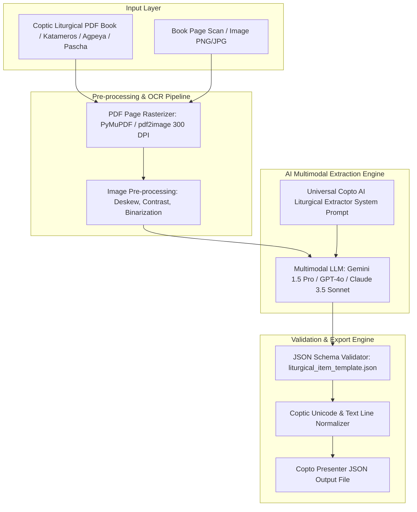

# Copto AI Liturgical Extractor Studio - Architecture & System Prompt Specification

This document provides the complete technical architecture and production LLM System Prompt for building **Copto AI Liturgical Extractor Studio** — an intelligent tool that ingests Coptic liturgical PDF books and page scans/images, extracts multilingual text (Coptic Unicode, Coptic Transliteration in English & Arabic, English, and Arabic), and outputs 100% schema-compliant **Copto Presenter JSON** files supporting **ALL Coptic Liturgies, Services, Tasbeha, Pascha, Katameros, and Sacraments**.

---

## 1. Supported Liturgical Categories & Scope

The extractor supports **ALL Coptic Orthodox Liturgical Services**:

1. **Holy Liturgies**:
   * Offering of the Lamb (*Alleluia Phai Pe Pi Ehoo*, *Soter Amen*, *The Glory & Honor*)
   * Liturgy of the Word (Pauline Epistle, Catholic Epistle, Praxis/Acts, Synaxarium, Trisagion, Psalm & Gospel)
   * Liturgy of St. Basil (Reconciliation, Anaphora, Sanctification, 7 Litanies, Commemoration, Fraction Prayers, Distribution)
   * Liturgy of St. Gregory & Liturgy of St. Cyril
2. **Agpeya (Book of Hours)**:
   * 1st, 3rd, 6th, 9th, 11th, 12th, Veil, Midnight Hour (Watches 1, 2, 3)
3. **Psalmodies & Praises (Tasbeha)**:
   * Midnight Tasbeha (1st, 2nd, 3rd, 4th Hos, 7 Daily Theotokias, Doxologies of Saints, Psali, Commemoration)
   * Vesper & Morning Praises
4. **Katameros Readings Engine**:
   * Daily Pauline, Catholic, Praxis, Synaxarium, Psalm Response, Holy Gospel
5. **Holy Pascha Week & Good Friday**:
   * Pascha Daytime & Nighttime Hours, General Funeral Prayer, Covenant Thursday, Good Friday, Apocalypse Night
6. **Sacraments & Rites**:
   * Holy Baptism, Holy Matrimony (Marriage), Unction of the Sick, Consecration of Churches, Feast Responses

---

## 2. System Architecture Diagram



---

## 3. Production Universal System Prompt for Vision LLM API

Below is the **exact production prompt** to be sent to the LLM (Gemini 1.5 Pro / GPT-4o) alongside the PDF page image:

```markdown
You are an expert Coptic Orthodox Liturgical Scholar and AI Multilingual Data Extractor for the Copto Presenter platform.

Your objective is to inspect the provided liturgical page image (or PDF scan) and extract all prayers, hymns, psalms, gospel passages, readings, litanies, doxologies, theotokias, psalis, expositions, responses, and absolutions into a 100% valid JSON structure adhering strictly to the Copto Presenter universal schema.

### EXTRACTION RULES:

1. **Multilingual Alignment (5 Languages)**:
   Extract and align text into up to 5 distinct language fields per item:
   - `coptic`: Coptic Unicode script (e.g. Ⲁⲙⲱⲓⲛⲓ ⲛⲧⲉⲛⲟⲩⲱϣⲧ). Use true Coptic Unicode characters (\u2C80-\u2CFF).
   - `copticTransliterationEng`: Coptic pronunciation in English letters (e.g. Amwini ntenouwsht).
   - `copticTransliterationAra`: Coptic pronunciation in Arabic letters (e.g. أمويني إنتينؤوشت).
   - `english`: English translation.
   - `arabic`: Arabic translation with correct spelling and diacritics.

2. **Structural Types**:
   Classify each item into one of the following `type` categories:
   - `"prayer"` (General prayer or response)
   - `"hymn"` (Liturgy or Tasbeha hymn)
   - `"psalm"` (Agpeya or Katameros psalm)
   - `"gospel"` (Holy Gospel reading)
   - `"reading"` (Pauline, Catholic, Praxis, Synaxarium, Exposition)
   - `"litany"` (Litany of Peace, Fathers, Places, Seeds, Waters, Sick, etc.)
   - `"absolution"` (Absolution prayer)
   - `"doxology"` (Doxology of Saint or Feast)
   - `"theotokia"` (Daily Theotokia stanza)
   - `"psali"` (Daily Psali)
   - `"response"` (Liturgical response)
   - `"rubric"` (Instructional text for worshipper/priest/deacon)

3. **Liturgical Roles**:
   Classify the officiating role (`"role"`):
   - `"priest"` (الكاهن / Ⲡⲓⲟⲩⲏⲃ)
   - `"deacon"` (الشماس / Ⲡⲓⲇⲓⲁⲕⲱⲛ)
   - `"people"` (الشعب / Ⲡⲓⲗⲁⲟⲥ)
   - `"reader"` (القارئ)
   - `"patriarch"` (البطريرك / Ⲡⲓⲡⲁⲧⲣⲓⲁⲣⲭⲏⲥ)
   - `"all"` (الجميع)

4. **Line Array Format**:
   Text paragraphs must be split into clean arrays of lines (`"text": { "english": [...], "arabic": [...] }`), matching line-by-line across all languages.

---

### OUTPUT UNIVERSAL JSON SCHEMA TEMPLATE:

Return ONLY valid JSON matching this exact structure with zero conversational text or markdown wrap errors:

{
  "id": "liturgy_basil_reconciliation_prayer",
  "category": "ST_BASIL_LITURGY_OF_THE_FAITHFUL",
  "type": "prayer",
  "role": "priest",
  "title": {
    "coptic": "Ⲫⲛⲟⲩϯ ⲡⲓⲛⲓϣϯ ⲛϣⲁⲉⲛⲉϩ",
    "copticTransliterationEng": "Phnouti pi-nishti nsha-eneh",
    "copticTransliterationAra": "إفنوتي بي نيشتي إنشا إينيه",
    "english": "Prayer of Reconciliation (St. Basil)",
    "arabic": "صلاة الصلح (القديس باسيليوس)"
  },
  "rubric": {
    "english": "The priest says the Prayer of Reconciliation:",
    "arabic": "يقول الكاهن صلاة الصلح:"
  },
  "items": [
    {
      "text": {
        "coptic": [
          "Ⲫⲛⲟⲩϯ ⲡⲓⲛⲓϣϯ ⲛϣⲁⲉⲛⲉϩ: ⲫⲏⲉⲧⲁϥⲑⲁⲙⲓⲟ ⲙⲡⲓⲣⲱⲙⲓ ⲉϩⲣⲏⲓ ⲉϫⲉⲛ ⲙⲉⲧⲁⲧⲧⲁⲕⲟ."
        ],
        "copticTransliterationEng": [
          "Phnouti pi-nishti nsha-eneh: phi-etaf-thamio mpi-romi ehrii ejen met-at-tako."
        ],
        "copticTransliterationAra": [
          "إفنوتي بي نيشتي إنشا إينيه: في إتاف ثاميو إمبي رومي إهريي إيجين ميت أت تاكو."
        ],
        "english": [
          "O God the Great, the Eternal, who created man in incorruption."
        ],
        "arabic": [
          "يا الله العظيم الأبدي، الذي خلق الإنسان على غير فساد."
        ]
      }
    }
  ]
}
```

---

## 4. Node.js Implementation Code for Developer

Below is a production-ready Node.js script using `@google/genai` (Gemini 1.5 Pro) to convert any liturgical PDF or image into `Copto Presenter` JSON:

```typescript
import { GoogleGenAI } from '@google/genai';
import fs from 'fs';

const ai = new GoogleGenAI({ apiKey: process.env.GEMINI_API_KEY });

export async function extractLiturgicalJsonFromImage(imagePath: string): Promise<any> {
  const imageBuffer = fs.readFileSync(imagePath);
  const base64Image = imageBuffer.toString('base64');

  const systemPrompt = `You are an expert Coptic Liturgical Scholar. Extract the page image into valid Copto Presenter JSON matching liturgical_item_template.json. Output ONLY JSON.`;

  const response = await ai.models.generateContent({
    model: 'gemini-1.5-pro',
    contents: [
      {
        role: 'user',
        parts: [
          { text: systemPrompt },
          {
            inlineData: {
              mimeType: 'image/png',
              data: base64Image
            }
          }
        ]
      }
    ],
    config: {
      responseMimeType: 'application/json'
    }
  });

  return JSON.parse(response.text);
}
```
