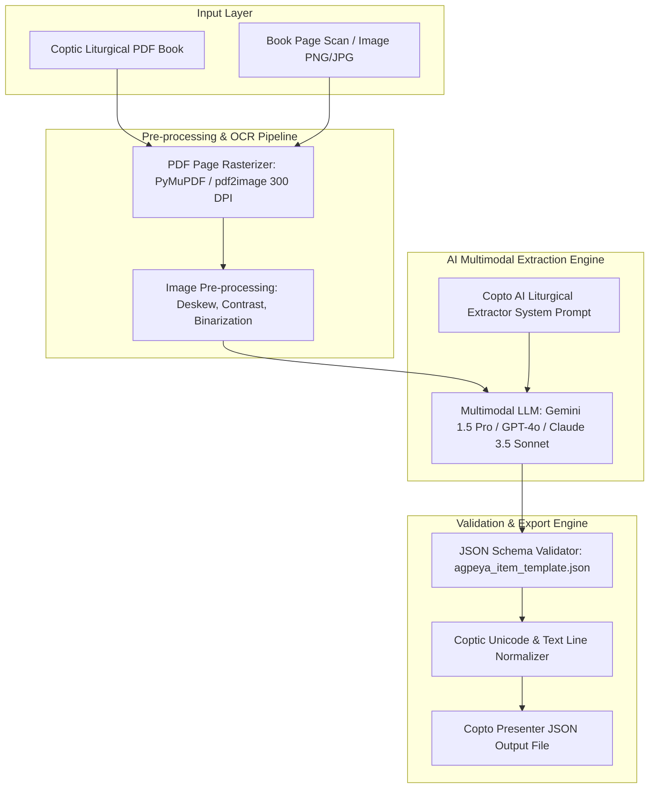

# Copto AI Liturgical Extractor Studio - Architecture & System Prompt Specification

This document provides the complete technical architecture and production LLM System Prompt for building **Copto AI Liturgical Extractor Studio** — an intelligent tool that ingests Coptic liturgical PDF books and page scans/images, extracts multilingual text (Coptic Unicode, Coptic Transliteration in English & Arabic, English, and Arabic), and outputs 100% schema-compliant **Copto Presenter JSON** files.

---

## 1. System Architecture Diagram



---

## 2. Technical Stack Recommendation

| Layer | Technology | Purpose |
| :--- | :--- | :--- |
| **CLI / Web Interface** | Node.js (TypeScript) / Python (FastAPI + Streamlit) | User interface for drag-and-drop PDF page processing |
| **PDF Rasterizer** | PyMuPDF (`fitz`) / `pdf2image` | Renders PDF pages to high-resolution 300 DPI images |
| **Vision LLM Provider** | Google Gemini 1.5 Pro API / OpenAI GPT-4o API | Multimodal layout analysis, Coptic OCR, and translation alignment |
| **Schema Validation** | `ajv` (TypeScript) or `jsonschema` (Python) | Validates extracted JSON against `agpeya_item_template.json` |

---

## 3. Production System Prompt for Vision LLM API

Below is the **exact production prompt** to be sent to the LLM (Gemini 1.5 Pro / GPT-4o) alongside the PDF page image:

```markdown
You are an expert Coptic Orthodox Liturgical Scholar and AI Multilingual Data Extractor for the Copto Presenter platform.

Your objective is to inspect the provided liturgical page image (or PDF scan) and extract all prayers, psalms, gospel passages, litanies, and absolutions into a 100% valid JSON structure adhering strictly to the Copto Presenter schema.

### EXTRACTION RULES:

1. **Multilingual Alignment (5 Languages)**:
   Extract and align text into up to 5 distinct language fields per item:
   - `coptic`: Coptic Unicode script (e.g. Ⲁⲙⲱⲓⲛⲓ ⲛⲧⲉⲛⲟⲩⲱϣⲧ). Use true Coptic Unicode characters (\u2C80-\u2CFF).
   - `copticTransliterationEng`: Coptic pronunciation in English letters (e.g. Amwini ntenouwsht).
   - `copticTransliterationAra`: Coptic pronunciation in Arabic letters (e.g. أمويني إنتينؤوشت).
   - `english`: English translation.
   - `arabic`: Arabic translation with correct spelling and diacritics.

2. **Structural Types**:
   Classify each item into one of the following `type` categories:
   - `"prayer"` (General prayer or response)
   - `"psalm"` (Agpeya psalm or liturgy psalm)
   - `"gospel"` (Agpeya or Liturgy Gospel reading)
   - `"litany"` (Litanies of peace, fathers, places, etc.)
   - `"absolution"` (Absolution to the Father/Son)
   - `"rubric"` (Instructional text for worshipper/priest/deacon)

3. **Liturgical Roles**:
   Classify the officiating role (`"role"`):
   - `"priest"` (الكاهن / Ⲡⲓⲟⲩⲏⲃ)
   - `"deacon"` (الشماس / Ⲡⲓⲇⲓⲁⲕⲱⲛ)
   - `"people"` (الشعب / Ⲡⲓⲗⲁⲟⲥ)
   - `"reader"` (القارئ)
   - `"all"` (الجميع)

4. **Line Array Format**:
   Text paragraphs must be split into clean arrays of lines (`"text": { "english": [...], "arabic": [...] }`), matching line-by-line across all languages.

---

### OUTPUT JSON SCHEMA TEMPLATE:

Return ONLY valid JSON matching this exact structure with zero conversational text or markdown wrap errors:

{
  "id": "agpeya_1st_hour_come_let_us_kneel",
  "type": "prayer",
  "role": "all",
  "title": {
    "coptic": "Ⲁⲙⲱⲓⲛⲓ ⲛⲧⲉⲛⲟⲩⲱϣⲧ",
    "copticTransliterationEng": "Amwini ntenouwsht",
    "copticTransliterationAra": "أمويني إنتينؤوشت",
    "english": "Come Let Us Kneel Down",
    "arabic": "هلم بنا نسجد"
  },
  "rubric": {
    "english": "The worshipper bows three times saying:",
    "arabic": "يسجد المصلي ثلاث سجدات قائلاً:"
  },
  "items": [
    {
      "text": {
        "coptic": [
          "Ⲁⲙⲱⲓⲛⲓ ⲛⲧⲉⲛⲟⲩⲱϣⲧ: ⲛⲧⲉⲛϯϩⲟ ⲉⲠⲭⲣⲓⲥⲧⲟⲥ Ⲡⲉⲛⲛⲟⲩϯ.",
          "Ⲁⲙⲱⲓⲛⲓ ⲛⲧⲉⲛⲟⲩⲱϣⲧ: ⲛⲧⲉⲛⲧⲱⲃϩ ⲙⲠⲭⲣⲓⲥⲧⲟⲥ Ⲡⲉⲛⲟⲩⲣⲟ."
        ],
        "copticTransliterationEng": [
          "Amwini ntenouwsht: ntentiho ePkhristos Pennouti.",
          "Amwini ntenouwsht: ntentobh mPkhristos Penouro."
        ],
        "copticTransliterationAra": [
          "أمويني إنتينؤوشت: إنتينتيهو إبخرستوس بيننوتي.",
          "أمويني إنتينؤوشت: إنتينطوبح إمبخرستوس بينؤرو."
        ],
        "english": [
          "Come let us kneel down, let us ask Christ our God.",
          "Come let us kneel down, let us beseech Christ our King."
        ],
        "arabic": [
          "هلم بنا نسجد، نطلب من المسيح إلهنا.",
          "هلم بنا نسجد، نتضرع إلى المسيح ملكنا."
        ]
      }
    }
  ]
}
```

---

## 4. Node.js Implementation Code for Developer

Below is a production-ready Node.js script using `@google/genai` (Gemini 1.5 Pro) to convert any liturgical PDF or image into `Copto Presenter` JSON:

```typescript
import { GoogleGenAI } from '@google/genai';
import fs from 'fs';
import path from 'path';

const ai = new GoogleGenAI({ apiKey: process.env.GEMINI_API_KEY });

export async function extractLiturgicalJsonFromImage(imagePath: string): Promise<any> {
  const imageBuffer = fs.readFileSync(imagePath);
  const base64Image = imageBuffer.toString('base64');

  const systemPrompt = `You are an expert Coptic Liturgical Scholar. Extract the page image into valid Copto Presenter JSON matching agpeya_item_template.json. Output ONLY JSON.`;

  const response = await ai.models.generateContent({
    model: 'gemini-1.5-pro',
    contents: [
      {
        role: 'user',
        parts: [
          { text: systemPrompt },
          {
            inlineData: {
              mimeType: 'image/png',
              data: base64Image
            }
          }
        ]
      }
    ],
    config: {
      responseMimeType: 'application/json'
    }
  });

  const rawJson = response.text;
  return JSON.parse(rawJson);
}
```
